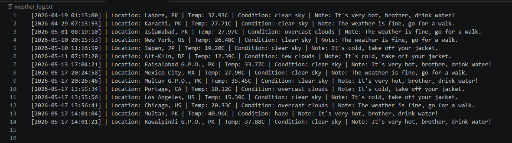

# 🌤️ WeatherPulse CLI

[](https://www.python.org/)
[](https://openweathermap.org/)
[](https://opensource.org/licenses/MIT)

An aesthetic, robust, and interactive Command-Line Interface (CLI) weather application built in Python. *WeatherPulse CLI* empowers users to fetch live weather analytics globally using either a City Name or ZIP Code. Featuring dynamic health/weather advice and automated background log archiving.

---

## 📸 Live Terminal Demonstration

Here is the complete application workflow in action:

<video src="assets/terminal_demo.mp4" width="100%" controls></video>

---

## ✨ Core Features

- *Dual-Mode Search engine:* Fetch accurate, real-time weather metrics via *City Name* or *ZIP/Postal Code*.
- *Smart Weather Insights:* Employs an intelligent algorithmic analysis to offer custom real-time advice based on current temperatures.
- *Automated Structured Logging:* Writes searches into a structured ledger (weather_log.txt) appending automated system timestamps.

---

## 📂 Archival System Preview

The system writes clean, readable system metrics to log archives:



---

## 🛠️ Setup and Installation

### 1. Clone the repository
```bash
git clone [https://github.com/hafizabdulaziz/weatherpulse_cli.git](https://github.com/hafizabdulaziz/weatherpulse_cli.git)